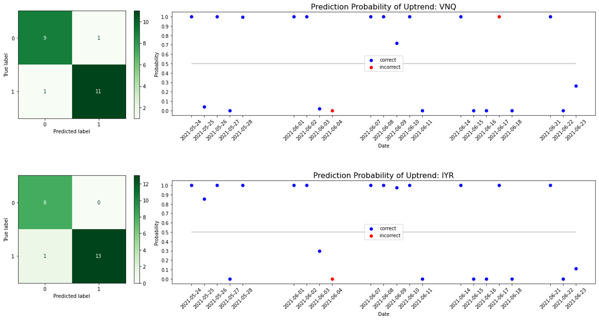
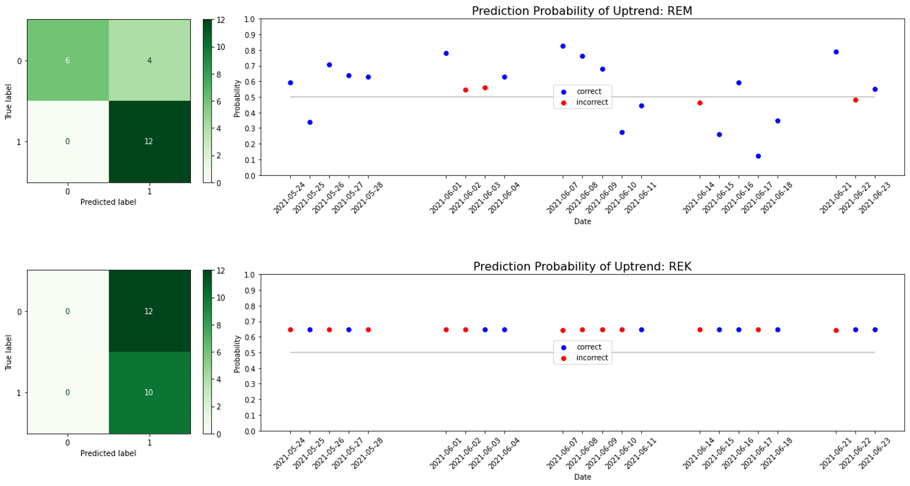

# REIT ETFs Forecasting
Author: [JingYun (Jonna) Wang](/jingyunwang24@gmail.com)


## Overview
This project is for all who want to increase the diversity of investment products. I used a regression model to predict future prices and a classification model to predict the movement for REIT ETFs. The historical data acquired from Yahoo Finance contains up-to-date price information. Potential investors can use my models to analyze REIT ETFs through technical perspectives.


## Business Problem
### Motivation
Many investors know that put money in real estate over long term could offer a reliable stream of income. This could also offer the benefit of tax reduction, direct ownership, potential growth of net worth, and so on. But those benefits accompany a lot of hands-on responsibilities. Before someone has a rental property, an upfront capital makes many investors unable to afford it. Invest in REIT ETFs (Real Estate Investment Trust Exchange-Traded Funds) offer a low investment requirement and hands-off way to earn dividends quarterly by purchasing baskets of stocks. But keep in mind, like other stock products, ETFs are also volatile, and have a strong correlation with the market. 

### Goal
Predict future price and movement through machine learning.


## Data
The historical price data from [Yahoo Finance](https://finance.yahoo.com/) are free to acquire through [yfinance API](https://pypi.org/project/yfinance/). Here, I focused on [Top REIT ETFs](https://etfdb.com/etfdb-category/real-estate/) for further analysis. The last date for all fetched ETFs was 06/23/2021.


## Methods
The initial approach was performed on VNQ time series. Train-val-test split was performed. Training set served as the learning step, validation set served as the model tuning, and test set (contains 22 days from 5/24/2021 to 6/23/2021) was used only once to see how well the model performes on unseen data.

***

### Regression: 
ARIMA, FBProphet, and LSTM models were used for prediciting future closing price. By comparing the test result, LSTM was selected as the best performing regression model.

|  Model | MAE | RMSE | R2 | Choice |
| :---: | :---: |:---: | :---: |:---: | 
| ARIMA | 4.6429 | 5.0535 | -4.9348 |  |
| FBProphet | 14.0614 | 14.1760 | -51.0399 |  |
| LSTM | 0.7419 | 0.9534 | 0.7756 | ✓ |

- [ARIMA](./notebook/2_ARIMA.ipynb)
- [FBProphet](./notebook/3_FBProphet.ipynb)
- [LSTM](./notebook/4_LSTM.ipynb)

***

### Classification:
[Classifier](./notebook/5_Classification.ipynb)</br>

Logistic Regression (baseline), KNN, Random Forest, Bagging, XGBoost, AdaBoost, Gradient Boosting, SVC, and NuSVC were used for predicting future uptrend/downtrend. By comparing the test result, NuSVCwas selected as the best performing regression model. 

|  Model | Accuracy | F1(0) | F1(1) | Choice |
| :---: | :---: |:---: | :---: |:---: |
| NuSVC | 0.9091 | 0.90 | 0.92 | ✓ |


## Model Evaluation
The best performance LSTM and NuSVC models were applied on the rest of <b>*14* </b>REIT ETFs to see if they're generalizable. Full visualization result can be viewed in the [Notebook](./Notebook.ipynb)


## Results
Evaluation on holdout test set for VNQ, IYR, REM, and REK.

### Why select these 4?
For better understanding, please refer to the "close price" plot shown above. The initial approach was performed on VNQ. IYR has a similar price range and trend to VNQ. REM has a slightly different trend from VNQ, and the price range for REM is far away from VNQ. REK has a totally different price range and trend from VNQ.






## Conclusion
By analyzing and building models on VNQ time series, LSTM model was selected for regression and NuSVC model was selected for classification. Both models were applied to the rest of the 14 REIT ETFs to see how the model is generalizable for different time series. 
- Regardless the time series has an upward trend or a downward trend, or even a different price range, LSTM is a good fit for price forecasting. This could be due to the nature of LSTM. LSTM chooses to remember relevant information and forget irrelevant during sequences processing
- NuSVC is more suitable some time series. This could be due to the nature of NuSVC classifier. For binary classification, NuSVC creates a hyperplane to separate different classes. Those have a closer price range with VNQ are more likely to generate good results. In contrast, those price range far away from VNQ generate results that could below the expectation


## Future Work
Further analysis can be explored on the following to provide additional insights and improve the model performance.
- <b>Model Variety</b>: Create different clasification models for different price ranges
- <b>Buy/Hold/Sell</b>: Create an alert when the prediction reaches certain point
- <b>Market Sentiment</b>: Web scrapping on social media to gather market information 
- <b>Extensive application</b>: Further develop models for other investment products with time series based
- <b>Model Deployment</b>: Automaticaly fetch new historical data, and run models for prediction


## For More Information
See the full analysis and modeling in the [Jupyter Notebook](./Notebook.ipynb) and [presentation](./Presentation.pdf).
For additional information please contact, JingYun (Jonna) Wang at jingyunwang24@gmail.com

## Repository Structure
```
├── data
├── images
├── models
├── notebook
│   ├── 1_Fetch_Data.ipynb
│   ├── 2_ARIMA.ipynb
│   ├── 3_FBProphet.ipynb
│   ├── 4_LSTM.ipynb
│   └── 5_Classification.ipynb
├── Notebook.ipynb
├── Presentation.pdf
├── README.md
└── util.py
```