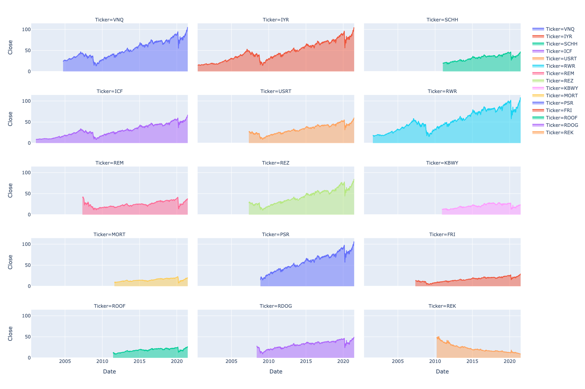
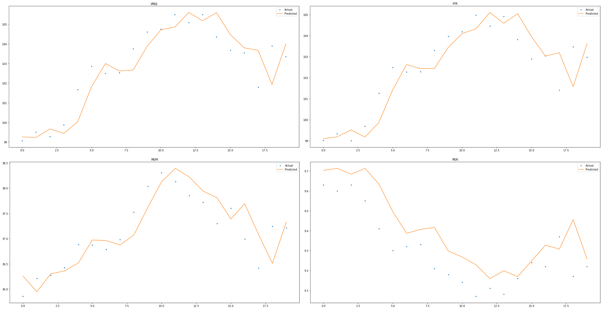
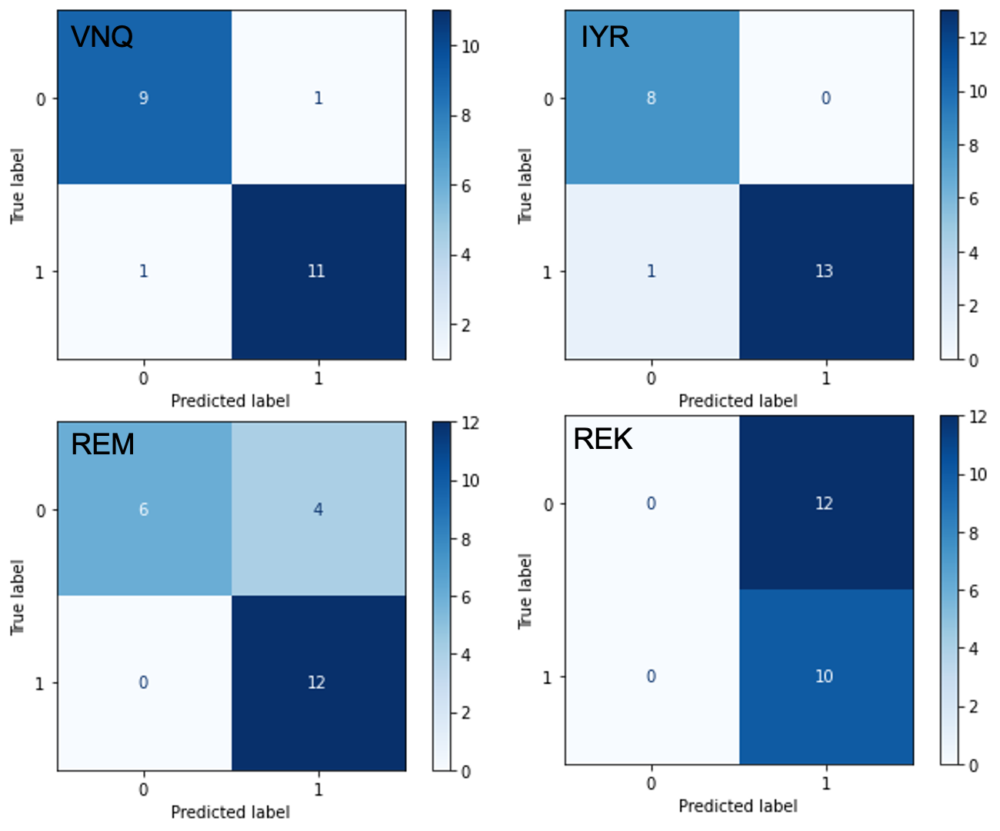

# REIT ETFs Forecasting
Author: [JingYun (Jonna) Wang](/jingyunwang24@gmail.com)

🌻 Currently working on it. 🌻


## Overview
This project uses a regression model for forecasting future prices and a classification model to predict the trend for REIT ETFs. The historical data acquired from Yahoo Finance contains up-to-date price information. Potential investors can use my models to predict both future prices and trends.


## Business Problem
### Motivation
Invest in real estate over long term could offer a reliable stream of income. This could also offer the benefit of tax reduction, direct ownership, potential growth of net worth, and so on. But those benefits come with a lot of hands-on responsibilities. Invest in REIT ETFs (Real Estate Investment Trust Exchange-Traded Funds) offer a low investment requirement and hands-off (but less control) way to earn dividends quarterly by purchasing baskets of stocks.

### Goal
Predict future price and trend through machine learning.


## Data
The historical price data from [Yahoo Finance](https://finance.yahoo.com/) are free to acquire through [yfinance API](https://pypi.org/project/yfinance/). Here, I focused on [Top REIT ETFs](https://etfdb.com/etfdb-category/real-estate/) for further analysis. The last date for all ETFs was 06/23/2021.




## Methods
The initial approach was performed on VNQ time series. Train-val-test split was performed. Training set served as the learning step, validation set served as the model tuning, and test set (contains 22 days from 5/24/2021 to 6/23/2021) was used only once to see how well the model performes on unseen data.

***

### Regression: 
ARIMA, FBProphet, and LSTM models were used for prediciting future closing price. By comparing the test result, LSTM was selected as the best performing regressio model.

|  Model | MAE | RMSE | R2 | Choice |
| :---: | :---: |:---: | :---: |:---: | 
| ARIMA | 4.6429 | 5.0535 | -4.9348 |  |
| FBProphet | 14.0614 | 14.1760 | -51.0399 |  |
| LSTM | 0.7419 | 0.9534 | 0.7756 | ✓ |

- [ARIMA](./notebook/2_ARIMA.ipynb)
- [FBProphet](./notebook/3_FBProphet.ipynb)
- [LSTM](./notebook/4_LSTM.ipynb)

***

### Classification:
[Classifier](./notebook/5_Classification.ipynb)</br>

Logistic Regression (baseline), KNN, Random Forest, Bagging, XGBoost, AdaBoost, Gradient Boosting, SVC, and NuSVC were used for predicting future uptrend/downtrend. By comparing the test result, NuSVCwas selected as the best performing regressio model. 

|  Model | Accuracy | F1(0) | F1(1) | Choice |
| :---: | :---: |:---: | :---: |:---: |
| NuSVC | 0.9091 | 0.90 | 0.92 | ✓ |


## Model Evaluation
The best performance LSTM and NuSVC models were applied on the rest of <b>*14* </b>REIT ETFs to see if they're generalizable. Full visualization result can be viewed in the [Notebook](./Notebook.ipynb)


## Results
Evaluation on holdout test set for VNQ, IYR, REM, and REK.




## Conclusion
By analyzing and building models on VNQ time series, LSTM model was selected for regression and NuSVC model was selected for classification. Both models were applied to the rest of the 14 REIT ETFs to see how the model is generalizable for different time series. LSTM is a good fit for price prediction no matter the time series has either an increasing trend or a decreasing trend. NuSVC is more like to fit for time series which have a closer price range with VNQ.

### Recommendation
- <b>Update</b>: Update the model periodically so that the model can learn new pattern


## Future Work
Further analysis can be explored on the following to provide additional insights and improve the model performance.
- <b>Buy/Hold/Sell</b>: Create an alert when the prediction reaches certain point
- <b>Market Sentiment</b>: Web scrapping on social media to gather market information 
- <b>Extensive application</b>: Further develop models for other investment products with time series based
- <b>Model Deployment</b>: Automaticaly fetch new historical data, and run models for prediction


## For More Information
See the full analysis and modeling in the [Jupyter Notebook](./Notebook.ipynb) and [presentation](./Presentation.pdf).
For additional information please contact, JingYun (Jonna) Wang at jingyunwang24@gmail.com

## Repository Structure
```
├── data
├── images
├── models
├── notebook
│   ├── 1_Fetch_Data.ipynb
│   ├── 2_ARIMA.ipynb
│   ├── 3_FBProphet.ipynb
│   ├── 4_LSTM.ipynb
│   └── 5_Classification.ipynb
├── Notebook.ipynb
├── Presentation.pdf
├── README.md
└── util.py
```